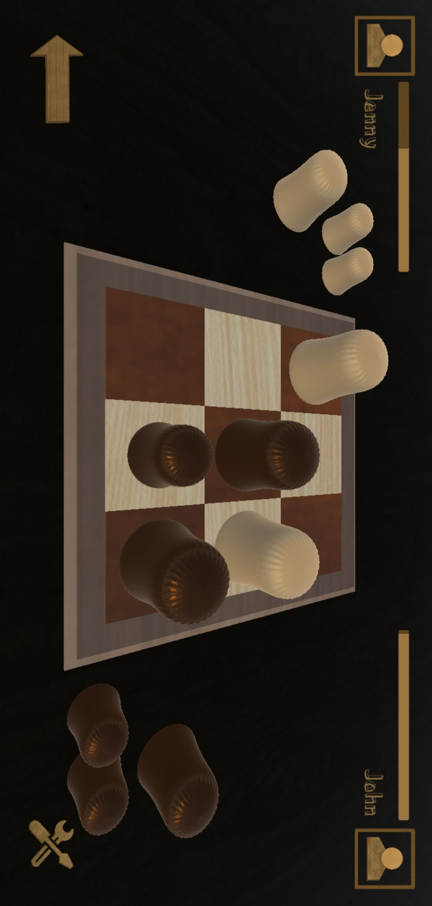

# GobbletPublic

**Gobblet** is a strategic board game where the objective is to be the first to line up three or four of your pieces horizontally, vertically, or diagonally. What sets *Gobblet* apart is its unique mechanism: players can "gobble up" their opponent's smaller pieces, adding an exciting layer of strategy and anticipation to each move. With intuitive rules and an elegant design, *Gobblet* provides endless fun for players of all ages and skill levels.

  

    
  

  

    
  

*Please note that the code for this application is private.*  

## 🛠️ Features

- **Strategic gameplay** with the ability to "gobble up" opponent pieces.
- **Two board options**: 3x3 for casual play and 4x4 for more strategic depth.
- **Multiple game modes**: Play against AI, locally with friends, or challenge opponents online.
- **Game continuation**: Resume your game from where you left off.
- **Custom profiles**: Track your wins and game history.

## 🧩 Board Options

### 3x3 Board
The 3x3 board provides a classic gameplay experience suitable for players of all skill levels.

  

### 4x4 Board
The 4x4 board offers a more challenging experience, requiring deeper strategic thinking and careful planning to win.

  

## 🎮 Game Modes

### One Player
In one-player mode, face off against an AI opponent that provides a challenging solo experience.

  

### Two Players
In two-player mode, enjoy the flexibility of playing with friends or challenging opponents online:
- **Local**: Play on the same device with a friend.
- **Online**: Engage in competitive matches with random opponents across the globe.

  

## ⏸️ Continue Game

If you need to pause, don't worry! Gobblet allows you to save and continue your game from where you left off.

  

## 👤 Profile

Track your progress, view your game history, and check your wins with custom player profiles.

  

Thank you for your interest in *Gobblet*! For more information, feel free to reach out or check the game on the Play Store.
