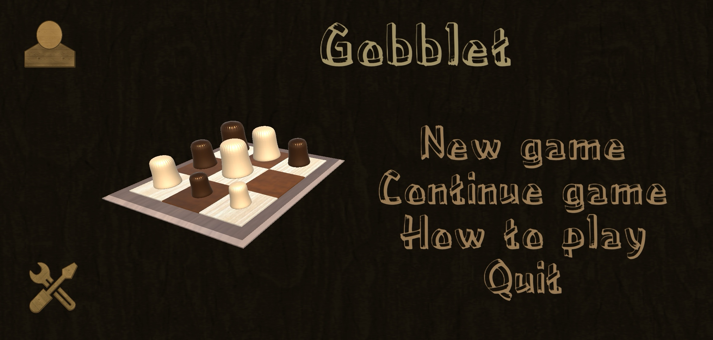
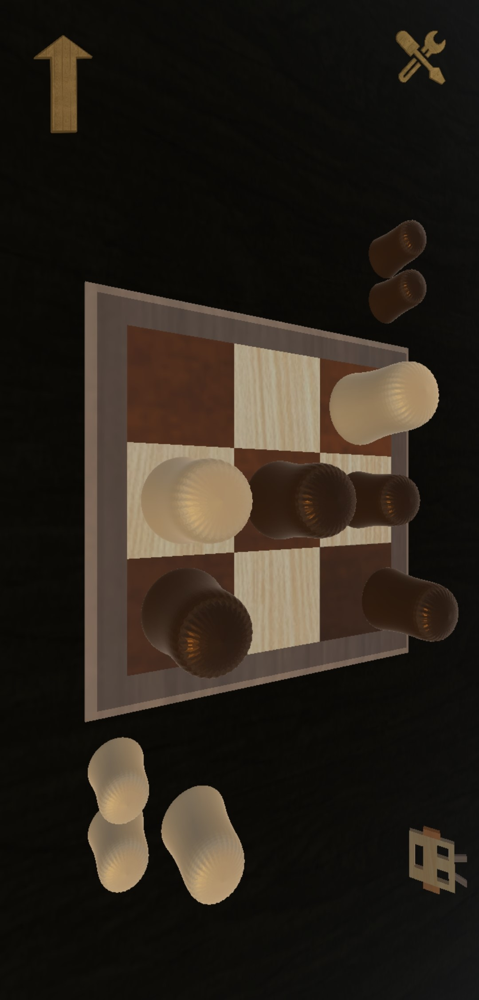

# GobbletPublic

**Gobblet** is a highly engaging and strategic board game where two players compete to line up three or four of their pieces in a row—horizontally, vertically, or diagonally. What makes *Gobblet* unique is its exciting "gobbling" mechanism: players can strategically cover their opponent’s smaller pieces, which introduces an added layer of depth and foresight. The game's simplicity in rules and elegant design ensures fun for everyone, from beginners to advanced players, while still offering enough complexity for those who enjoy deep strategic thinking.

Whether you prefer quick, casual matches or long, strategic battles, *Gobblet* caters to all types of players. With both 3x3 and 4x4 board options, different game modes, and the ability to play offline, online, or locally, *Gobblet* promises hours of entertainment.

  

    
  

  

    
  

> **Please note**: The code for this application is private.

## 🛠️ Key Features

- **Strategic gameplay**: Incorporate the unique ability to "gobble up" your opponent’s smaller pieces to gain an advantage.
- **Board options**: Choose between two different board sizes for varied gameplay:
  - **3x3 board** for quicker, casual games.
  - **4x4 board** for more strategic and challenging experiences.
- **Multiple game modes**:
  - Play against a **computer AI** with multiple difficulty levels.
  - **Local two-player mode** to play with a friend on the same device.
  - **Online multiplayer** for challenging global opponents.
- **Game continuation**: Save and resume games seamlessly, ensuring you never lose progress during intense matches.
- **Custom profiles**: Keep track of your wins, losses, and match history.
- **Cross-device sync**: Play across multiple devices by logging into your profile.

  

## 🧩 Board Options

### 3x3 Board
The 3x3 board is perfect for players who prefer fast-paced games with simpler strategies. Its compact design keeps the game quick but still retains a good level of tactical depth. It’s ideal for casual players or those just learning the game mechanics.

  

### 4x4 Board
For more seasoned players, the 4x4 board introduces longer, more complex matches. With more pieces and space on the board, players must think carefully and plan multiple moves ahead to avoid being gobbled up and outplayed.

  

Both boards feature the same core gameplay but cater to different styles and preferences, allowing *Gobblet* to be enjoyed by a wide audience.

## 🎮 Game Modes

### One Player
In one-player mode, you are pitted against an AI opponent. The AI has multiple difficulty levels, ranging from beginner-friendly to highly strategic, providing a suitable challenge for any player. Whether you're honing your skills or testing strategies, this mode ensures you're never short of a worthy opponent.

  

### Two Players
For those who enjoy playing with others, *Gobblet* offers two exciting options:

- **Local Play**: Play against a friend on the same device, taking turns to outwit one another.
- **Online Play**: Match with players from around the world for competitive multiplayer battles. Challenge random opponents or invite friends for an online showdown.

  

Both modes encourage strategic thinking and provide endless opportunities for fun and competition.

## ⏸️ Game Continuation

Life happens, and sometimes you need to pause a game. With *Gobblet*, you never have to worry about losing your progress. The game features a save-and-resume option, allowing you to pick up exactly where you left off whenever you’re ready to continue your match.

  

This feature ensures that even long, strategic games can be enjoyed at your own pace.

## 👤 Player Profile

Keep track of your progress with the customizable player profile system. Your profile logs important stats such as:
- **Number of games played**: Track how many games you've completed.
- **Wins and losses**: See your victories and defeats in both local and online matches.
- **Game history**: Review your past matches to study your moves and improve your strategy.

  

With your profile, you can showcase your skills and challenge friends or opponents to try and beat your record.

Thank you for your interest in *Gobblet*! Whether you're a casual player or a strategic mastermind, we hope you enjoy the game and all it has to offer.
