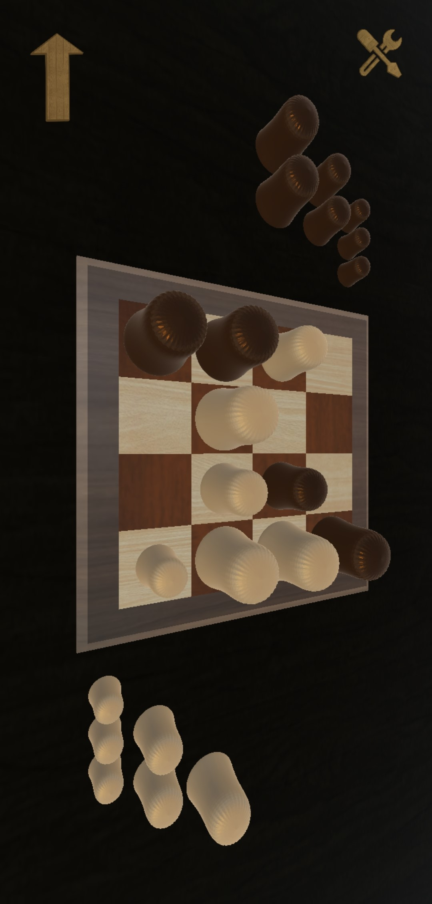

# GobbletPublic
Gobblet is a strategic board game. Players aim to be the first to line up three/four of their pieces horizontally, vertically or diagonally. What sets Gobblet apart is its unique mechanism where players can "gobble up" their opponent's smaller pieces, adding strategy and anticipation to the gameplay. With elegant design and intuitive rules, Gobblet offers fun for players of all ages and skill levels.

  

    
  

  

    
  

<em>Please note that the code for this application is private.</em>  

## Board Options

### 3x3 Board

The 3x3 board provides a classic gameplay experience suitable for players of all skill levels.

  

### 4x4 Board

The 4x4 board offers a more challenging gameplay experience, requiring strategic thinking and careful planning to achieve victory.

  

## Game Modes

### One Player

In one-player mode, you can play against the computer AI for a challenging solo experience.

  

### Two Players

In two-player mode, you have two options:

- **Local**: Play against a friend on the same device, taking turns to make moves.
- **Online**: Challenge random opponents online for exciting multiplayer matches.

## Continue Game

If you need to take a break, don't worry! You can continue your game later from where you left off.

  

##Profile

  

